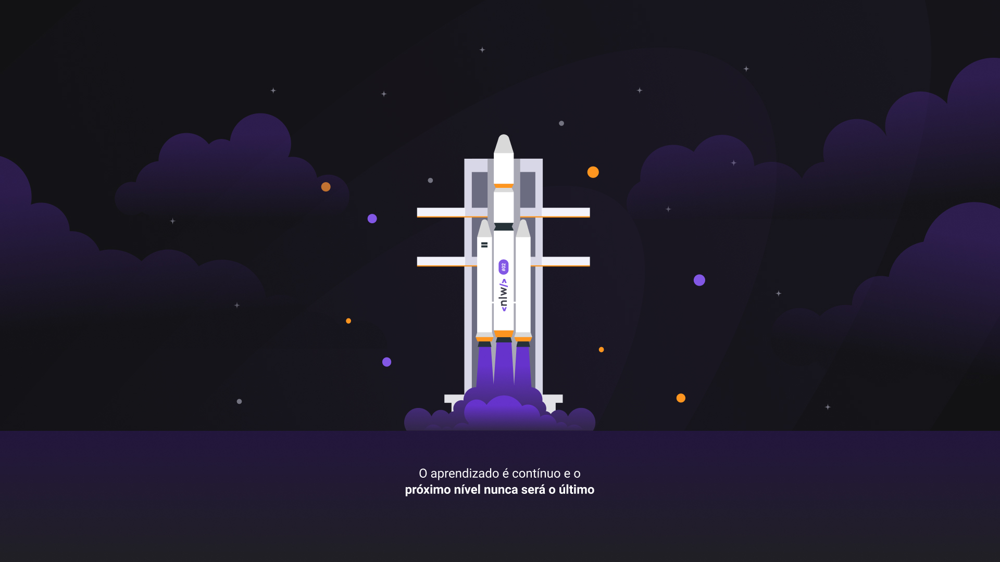
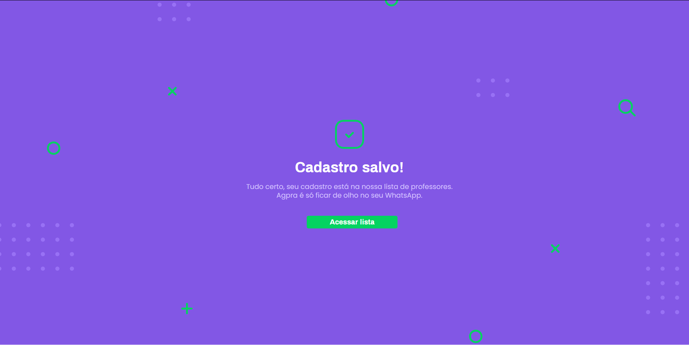
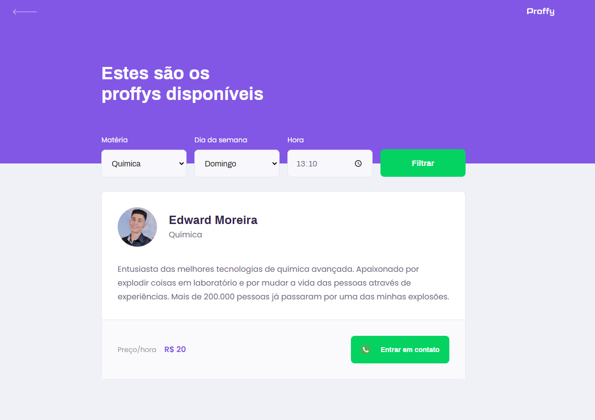
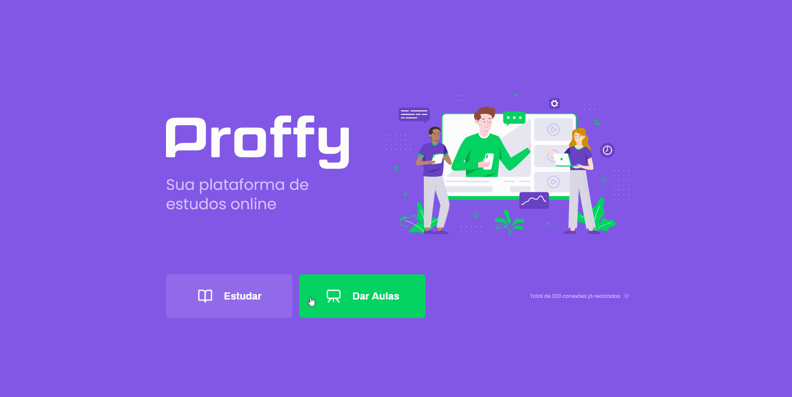

# :mortar_board: Proffy | Next Level Week #02 :rocket:

<p align="center">	
  

  <a href="https://github.com/edward-mn/proffy-nlw/commits/master">
    
  </a> 
  
  
  
  <a href="https://github.com/edward-mn/proffy-nlw/stargazers">
    
  </a>
  
     
</p>

> The central idea of the application is to create an online study platform where it will be possible to study or teach classes.

<p align="center">
   
</p>

## :framed_picture: Pictures of app
- Pictures

<div style="display: flex; flex-direction: 'row'; align-items: 'center';">
   
   
   
</div>

- GIF
<p align="center">
   
</p>

## :wrench: Technologies 
- [HTML5](https://pt.wikipedia.org/wiki/HTML5)
- [CSS3](https://pt.wikipedia.org/wiki/CSS3)
- [Java Script](https://www.javascript.com/)
- [Banco de dados (Sqlite)](https://www.sqlite.org/index.html) 

## :computer: Functionalities

:man_teacher: Give classes:
- Fill in your personal and professional information about yourself, so that a profile is created and with that the students are able to select it according to their description.

📚 To study:
- Find courses through the filters that will be used at the time of the search, along with information from the instructors registered in Teaching.

## :construction_worker: How to run
```
npm install
npm rum dev
```
> After open your <b>localhost:5500</b>

## :package: How to [download](https://github.com/edward-mn/proffy-nlw/archive/master.zip)
```bash
# Clone o Repositoria
$ git clone git@github.com:edward-mn/proffy-nlw.git
```

## 🔗 Important links:

- Exchange of ideas with the communities: [Discord](https://discord.com/invite/zgvZhUP)
- Event Information: [handout](https://storage.googleapis.com/golden-wind/nextlevelweek/Apostila-NLW2.pdf)
- Want to participate: [Event](https://nextlevelweek.com/inscricao/2)
